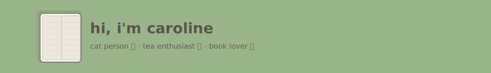

  

  

---
## About 👩🏻‍💻
I’m a fourth-year CS and Design student who loves all things frontend, design, and HCI. I’m passionate about creating interfaces that feel effortless to use and meaningful to interact with.
> Right now, I’m focused on building my Next.js, TypeScript, and Figma skills while exploring how design and technology come together to truly ***prioritize the user experience***.

## Language Breakdown 📊

  

---

## Connect With Me 🧩

  
  &nbsp;
  

---

  

